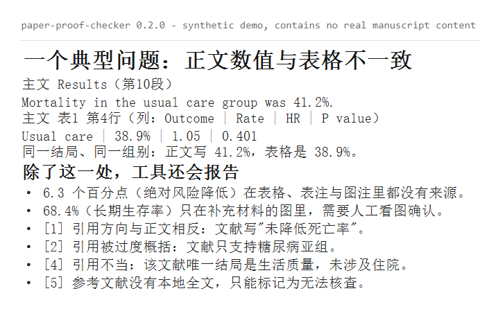
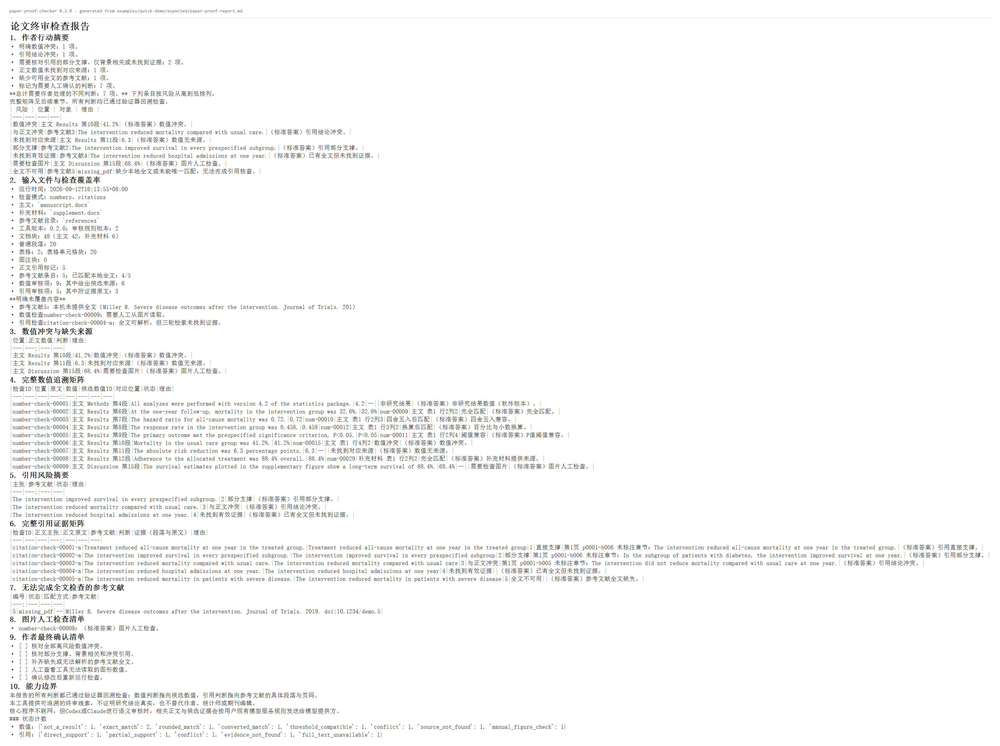

# paper-proof-checker

**一句话**：检查论文正文里的数值和引用，能不能回到你自己的表格、表注、图注和本地参考文献全文——每一条判断都指向具体位置，而不是"看起来差不多"。

它只做一件事：**证据能否回溯**。它不判断研究结论对不对，也不替你决定怎么改。

---

## 1. 它解决什么问题

论文定稿前最容易漏掉、也最难自查的两类错误：

1. **数值不一致**：正文写 `41.2%`，表格里同一行是 `38.9%`；或者正文引用了一个表格里根本没有的数字。
2. **引用不支撑**：正文说"所有亚组都改善"，被引文献其实只报告了其中一个亚组；甚至文献结论与正文方向相反。

人工校对要靠肉眼在正文、表格、图注和一堆 PDF 之间来回跳。本工具把这件事变成一条可复核的流水线。

---

## 2. 一个真实会发生的例子



同一结局、同一组别，正文与表格给出了两个不同的数。工具会把这一处标为**数值冲突**，
并同时指出它所在的具体段落。

---

## 3. 五分钟快速体验

仓库自带一套**完全虚构的合成论文**（`examples/quick-demo/`），不需要准备任何真实数据。

```powershell
# 1. 安装
pipx install .

# 2. 进入自带的合成 Demo
cd examples/quick-demo

# 3. 确定性解析：生成待审核批次
paper-proof prepare . --checks all --reference-map reference-map.json

# 4. 让 Codex / Claude 按 Skill 规则写入 reviews/，然后验证
paper-proof validate .\paper-proof-output\<时间戳目录>

# 5. 生成报告
paper-proof report .\paper-proof-output\<时间戳目录>
```

第 4 步也可以在没有任何模型的条件下完成：`examples/quick-demo/expected/` 里提供了标准审核 JSON，
直接复制到运行目录的 `reviews/` 下即可跑通全流程，并与 `expected/paper-proof-report.md` 逐字比对。

不需要参考文献 PDF 时（很常见），只跑数值检查：

```powershell
paper-proof prepare . --checks numbers
```

---

## 4. 三种检查模式

| 模式 | 命令 | 需要的输入 | 适用场景 |
|---|---|---|---|
| `numbers` | `paper-proof prepare <项目> --checks numbers` | 主文 DOCX（补充材料可选） | 只核对数值；**不需要**参考文献目录 |
| `citations` | `paper-proof prepare <项目> --checks citations` | 主文 DOCX + 参考文献 PDF 目录 | 只核对引用是否被原文支撑 |
| `all` | `paper-proof prepare <项目> --checks all` | 同上 | 完整终审检查（默认） |

判别规则简单：**手上有 PDF 才做引用检查。** 没有 PDF 就只会输出"全文不可用"，没有意义。

---

## 5. 输出报告样式



报告的第一屏是**作者行动摘要**——按风险从高到低列出需要处理的事项，而不是让作者自己去长表格里找问题。随后是解析覆盖率（明确写出哪些内容没被覆盖）和完整追溯矩阵：

- 数值判断回到：主文/补充材料、章节或表格行列、`number_id`
- 引用判断回到：参考文献编号、`paragraph_id`、真实 PDF 页码、逐字原文

报告只写**项目相对路径**；本机绝对路径仅保留在本地 `manifest.json` 中，不会写进报告。

---

## 6. 工具能力说明

| 你可能想要的 | 本工具 | 说明 |
|---|---|---|
| 检查参考文献格式、字段完整性 | ✗ | 那是参考文献管理软件（Zotero/EndNote）与期刊模板检查的事 |
| 通读全文做学术审阅 | ✗ | 本工具只看"数值能否回溯、引用能否被原文支撑" |
| 复现研究结果（重跑统计） | ✗ | 本工具不重算统计量，只做一致性核对 |
| 语言润色、语法校对 | ✗ | 不涉及语言质量 |
| 核对正文数值 vs 表格/图注 | ✓ | 核心能力之一 |
| 核对引用主张 vs 本地全文 | ✓ | 核心能力之二 |

---

## 7. 输入格式

### 输入格式

- 主文与补充材料：`.docx`（不支持 PDF / LaTeX / 扫描件）
- 参考文献：带**文本层**的 `.pdf`（扫描件会返回 `parse_failed`，不会被当成"没有支撑"）
- 引用格式：Vancouver 顺序编码，如 `[12]`、`[12–15]`

